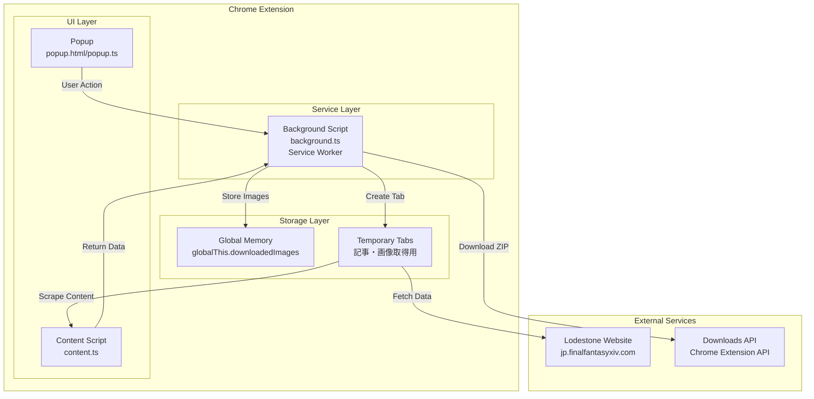
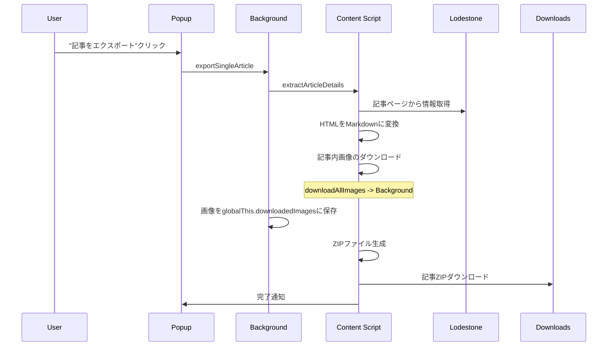
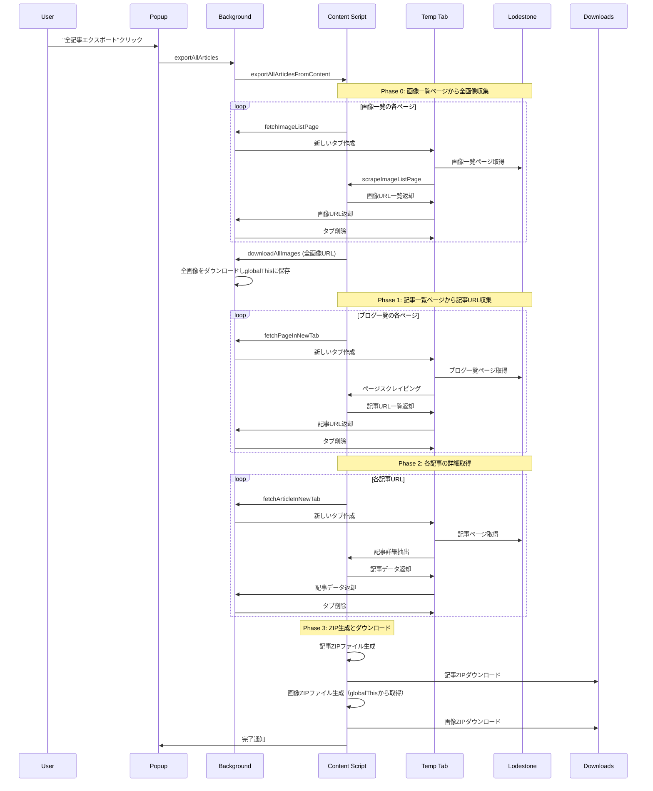
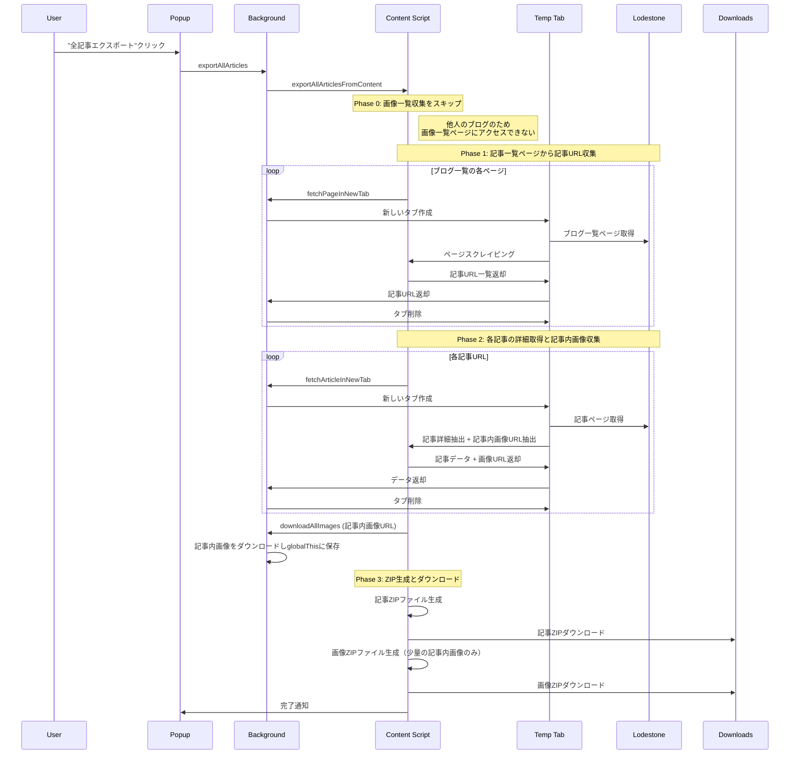
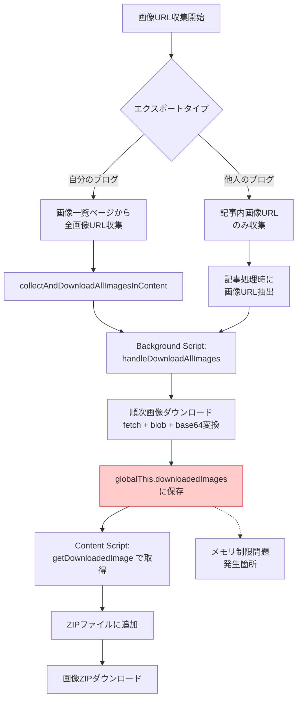
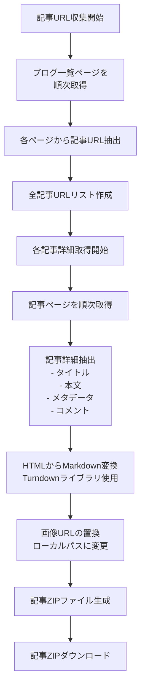
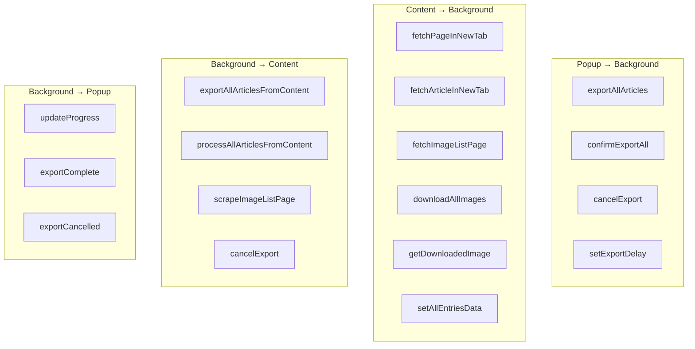
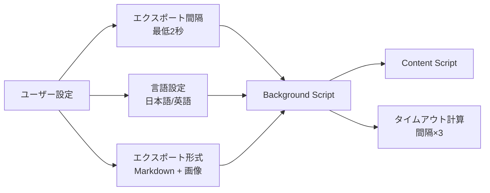

# SyncStone Chrome拡張機能 設計書

## 概要

SyncStone Chrome拡張機能は、ロードストーン（FFXIV公式サイト）のブログ記事と画像をMarkdown形式でエクスポートするツールです。

## アーキテクチャ概要



## コンポーネント役割分担

### 1. Popup (popup.ts)
**責任範囲**: ユーザーインターフェース
- ユーザー操作の受付
- エクスポート設定の管理
- 進捗表示の更新
- エラーメッセージの表示

### 2. Content Script (content.ts)
**責任範囲**: Webページのスクレイピング
- ブログ記事一覧の抽出
- 記事詳細の抽出
- 画像一覧ページのスクレイピング
- HTMLからMarkdownへの変換
- ZIPファイルの生成

### 3. Background Script (background.ts)
**責任範囲**: 中央制御とリソース管理
- タブの作成と管理
- 画像のダウンロード処理
- グローバル状態の管理
- メッセージルーティング
- ファイルダウンロードの実行

## エクスポート処理フロー

### A. 個別記事エクスポート



### B. 全記事エクスポート（自分のブログ）



### C. 全記事エクスポート（他人のブログ）



## データフロー詳細

### 画像処理フロー



### 記事処理フロー



## メッセージパッシング

### メッセージタイプ一覧



## 現在の問題点と対策

### 問題: 画像ZIPに含まれる画像が不完全

**症状**: 
- 約80ファイル程度の軽いJPEG画像のみがZIPに含まれる
- アルファベット順や軽いサイズなど、何らかの基準で選別されている
- エラーは表示されない

**原因分析**:
1. **Service Workerメモリ制限**: `globalThis.downloadedImages`に大量のbase64画像を保存する際、Chrome Service Workerのメモリ制限に達している可能性
2. **非同期処理のタイミング問題**: 画像ダウンロード完了前にZIP生成が開始される可能性
3. **フェッチ処理の失敗**: 一部の画像のダウンロードが失敗しているが、エラーハンドリングで隠蔽されている可能性

**対策案**:
1. **IndexedDB使用**: globalThisの代わりにIndexedDBを使用してbase64画像を保存
2. **バッチ処理**: 画像を小さなバッチに分けてダウンロード・保存
3. **エラーログ強化**: 画像ダウンロード失敗の詳細ログを追加

## ファイル構造

```
src/
├── background/
│   └── background.ts          # Service Worker、中央制御
├── content/
│   └── content.ts            # スクレイピング、ZIP生成
├── popup/
│   ├── popup.html           # UI
│   └── popup.ts             # UI制御
├── utils/
│   ├── constants.ts         # 定数定義
│   └── helpers.ts           # ユーティリティ関数
└── types/
    └── index.ts             # TypeScript型定義
```

## 設定とカスタマイズ



---

この設計書により、SyncStone Chrome拡張機能の全体像と、画像エクスポート問題の発生箇所が明確になりました。特に`globalThis.downloadedImages`でのメモリ制限が最も可能性の高い原因として特定されています。