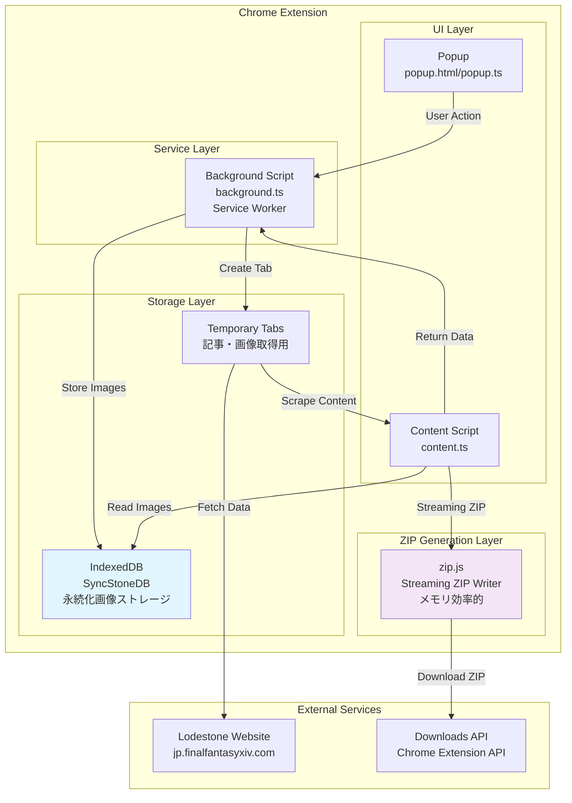
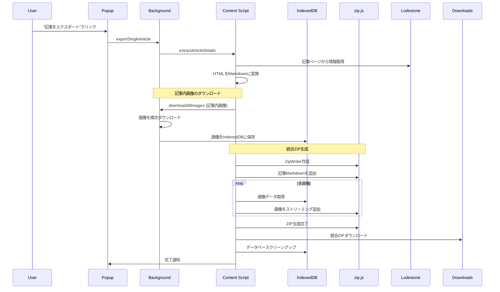
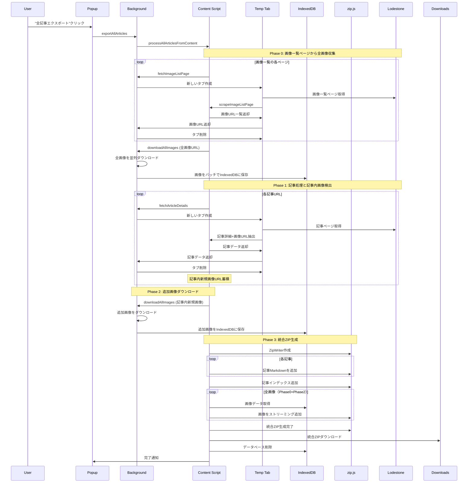
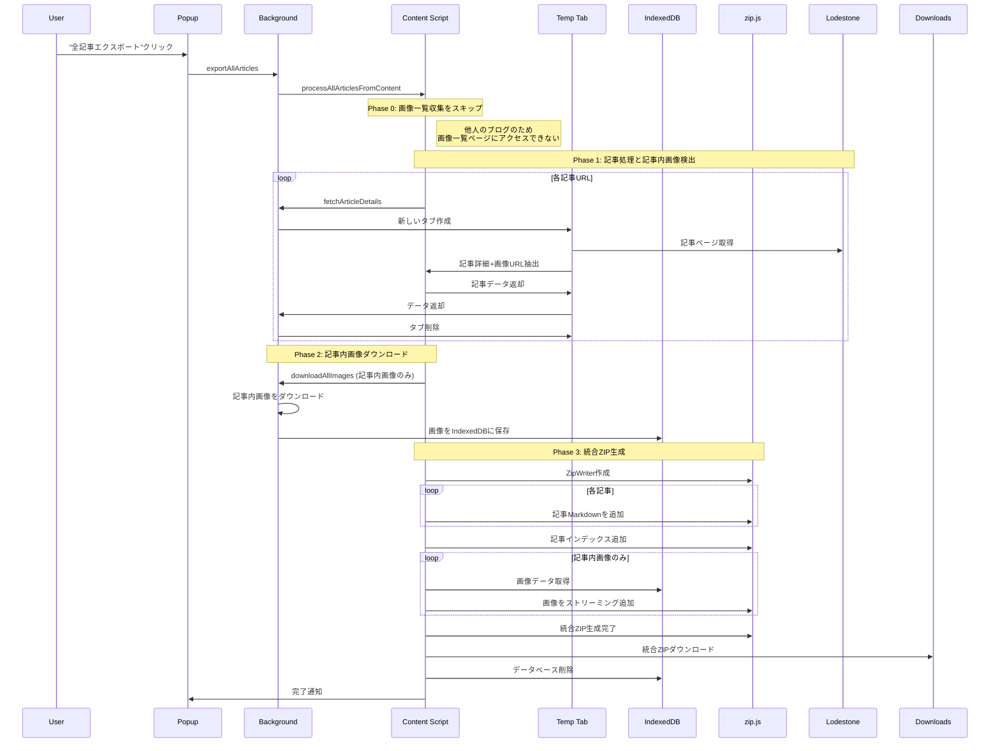
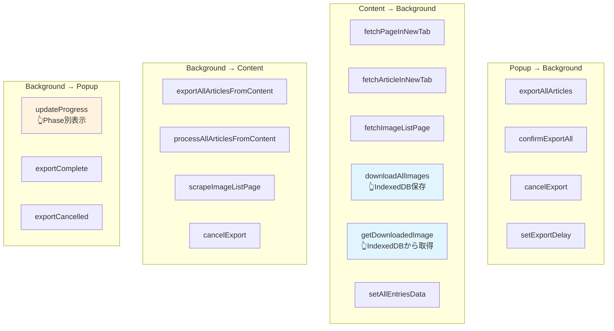
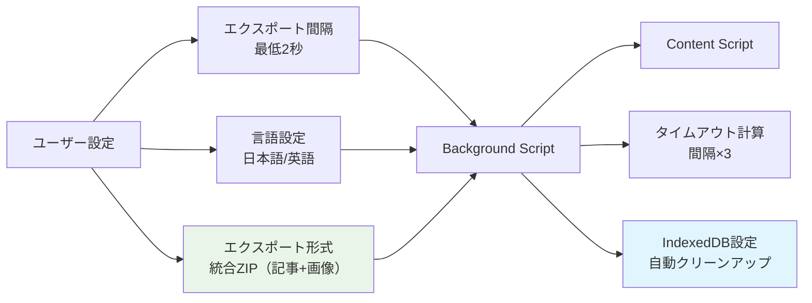

# SyncStone Chrome拡張機能 設計書 v2.0

## 概要

SyncStone Chrome拡張機能は、ロードストーン（FFXIV公式サイト）のブログ記事と画像をMarkdown形式でエクスポートするツールです。

**重要な変更**: 2025年の大幅リファクタリングにより、メモリ制限問題を解決するためIndexedDBとzip.jsストリーミングを導入し、記事と画像を統合したZIPファイル生成に変更されました。

## アーキテクチャ概要



## コンポーネント役割分担

### 1. Popup (popup.ts)
**責任範囲**: ユーザーインターフェース
- ユーザー操作の受付
- エクスポート設定の管理（アクセス間隔など）
- 進捗表示の更新（Phase別表示）
- エラーメッセージの表示
- ガラス調UI デザイン

### 2. Content Script (content.ts)
**責任範囲**: Webページのスクレイピングと統合ZIP生成
- ブログ記事一覧の抽出
- 記事詳細の抽出（記事内画像URL検出含む）
- 画像一覧ページのスクレイピング
- HTMLからMarkdownへの変換（Turndown使用）
- **IndexedDBからの画像データ読み込み**
- **zip.jsによる統合ZIP生成（記事+画像）**

### 3. Background Script (background.ts)
**責任範囲**: 中央制御とリソース管理
- タブの作成と管理
- 画像のダウンロード処理
- **IndexedDBへの画像データ保存**
- メッセージルーティング
- エクスポート状態管理

### 4. IndexedDB (utils/indexedDB.ts)
**責任範囲**: 永続的画像データストレージ
- base64画像データの保存・取得
- バッチ処理によるメモリ効率化
- エクスポート完了後の自動クリーンアップ
- Chrome Service Workerメモリ制限の回避

## エクスポート処理フロー（更新版）

### A. 個別記事エクスポート



### B. 全記事エクスポート（自分のブログ）- 3フェーズ処理



### C. 全記事エクスポート（他人のブログ）



## データフロー詳細

### 画像処理フロー（IndexedDB対応版）

```mermaid
flowchart TD
    A[画像URL収集開始] --> B{エクスポートタイプ}
    
    B -->|自分のブログ| C[Phase 0: 画像一覧ページから<br/>全画像URL収集]
    B -->|他人のブログ| D[Phase 1: 記事内画像URL<br/>のみ収集]
    
    C --> E[collectAndDownloadAllImagesInContent]
    D --> F[Phase 1記事処理時に<br/>画像URL抽出]
    
    E --> G[Background Script:<br/>handleDownloadAllImages]
    F --> H[Phase 2: 追加画像<br/>ダウンロード]
    H --> G
    
    G --> I[並列画像ダウンロード<br/>fetch + blob + base64変換]
    I --> J[IndexedDB<br/>SyncStoneDB.images<br/>バッチ保存]
    
    J --> K[Content Script:<br/>IndexedDBから画像取得]
    K --> L[zip.js ストリーミング<br/>ZipWriter.add()]
    L --> M[統合ZIP生成<br/>（記事+画像）]
    M --> N[エクスポート完了後<br/>IndexedDB削除]
    
    style J fill:#e1f5fe
    style L fill:#f3e5f5
    style M fill:#e8f5e8
    note1[メモリ制限問題<br/>解決済み]
    J -.-> note1
```

### ZIP生成フロー（zip.js対応版）

```mermaid
flowchart TD
    A[統合ZIP生成開始] --> B[zip.js ZipWriter作成<br/>new BlobWriter()]
    
    B --> C[記事Markdown追加]
    C --> D[記事インデックス追加]
    
    D --> E[画像追加開始]
    E --> F[IndexedDBから画像データ取得]
    F --> G[base64からUint8Array変換]
    G --> H[zip.js ストリーミング追加<br/>Uint8ArrayReader]
    
    H --> I{全画像完了?}
    I -->|No| F
    I -->|Yes| J[ZipWriter.close()]
    
    J --> K[Blob生成]
    K --> L[downloadStreamingZip]
    L --> M[ユーザーダウンロード]
    
    style B fill:#f3e5f5
    style H fill:#f3e5f5
    style K fill:#e8f5e8
    
    note1[JSZip問題<br/>RangeError解決]
    K -.-> note1
```

## メッセージパッシング

### メッセージタイプ一覧（更新版）



## 技術的改善点

### 1. メモリ制限問題の解決

**旧実装 (問題)**:
```javascript
// globalThis.downloadedImagesに全画像を保存
globalThis.downloadedImages = []; // メモリ制限に到達
```

**新実装 (解決)**:
```javascript
// IndexedDBによる永続化
await saveImage({
  url: imageUrl,
  base64: base64Data,
  filename: filename,
  success: true
});
```

### 2. ZIP生成の改善

**旧実装 (問題)**:
```javascript
// JSZip - メモリ内で全データ保持
const zip = new JSZip();
zip.file('article.md', content);
const content = await zip.generateAsync({type: 'base64'}); // RangeError
```

**新実装 (解決)**:
```javascript
// zip.js - ストリーミング処理
const zipWriter = new zip.ZipWriter(new zip.BlobWriter());
await zipWriter.add('article.md', new zip.TextReader(content));
await zipWriter.add('image.jpg', new zip.Uint8ArrayReader(imageBytes));
const zipBlob = await zipWriter.close(); // メモリ効率的
```

### 3. 統合ZIP生成

**旧実装**:
- 記事ZIP と 画像ZIP を分離
- 2つのZIPファイルを個別ダウンロード

**新実装**:
- 記事と画像を1つの統合ZIPに
- ユーザビリティの向上
- ファイル管理の簡素化

## ログシステム

### 統一ログフォーマット

```javascript
// フェーズ別ログ
console.log('[EXPORT-LOG] ========== START FULL EXPORT ==========');
console.log('[EXPORT-LOG] Phase 0: Image list download check');
console.log('[EXPORT-LOG] Phase 1: Processing 78 articles');
console.log('[EXPORT-LOG] Phase 2: Additional image download from articles');
console.log('[EXPORT-LOG] Phase 3: Converting articles to Markdown');

// 画像処理ログ
console.log('[DOWNLOAD-LOG] Starting to download 446 images');
console.log('[PULL-LOG] Getting downloaded images from IndexedDB');
console.log('[STREAMING-ZIP] Adding image 446/446 to ZIP');

// システムログ
console.log('[IndexedDB] Database deleted after successful export');
console.log('[Background] Export configuration received');
```

### 記事内画像検出ログ（新規追加）

```javascript
// 個別記事での画像検出
console.log('[EXPORT-LOG] Article 15: Detected 3 new image URLs in article content');
console.log('[EXPORT-LOG] Article 15: Detected 1 new thumbnail URLs');
console.log('[EXPORT-LOG] Article 15: Total 4 new images detected, running total: 127 unique images');

// Phase 2での追加処理
console.log('[EXPORT-LOG] Phase 2: Total unique images found in articles: 84');
console.log('[EXPORT-LOG] Phase 2: Already downloaded from image list: 0');
console.log('[EXPORT-LOG] Phase 2: Additional images to download: 84');
```

## 現在の解決済み問題

### ✅ 解決: 画像エクスポートの不完全問題

**問題**: 約80ファイル程度の軽いJPEG画像のみがエクスポートされていた

**原因**: 
1. Chrome Service Workerのメモリ制限（globalThis使用）
2. JSZipでの大量データ処理時のRangeError
3. 2回のダウンロードフェーズで1回目のデータが消失

**解決策**:
1. **IndexedDB導入**: globalThisからIndexedDBへ移行してメモリ制限を回避
2. **zip.js移行**: JSZipからzip.jsストリーミング処理で大容量ZIP対応
3. **データ保持**: handleDownloadAllImagesで既存画像を保持する処理追加
4. **統合ZIP**: 記事と画像を1つのZIPファイルに統合

## ファイル構造（更新版）

```
src/
├── background/
│   └── background.ts          # Service Worker、中央制御、IndexedDB保存
├── content/
│   └── content.ts            # スクレイピング、zip.js統合ZIP生成
├── popup/
│   ├── popup.html           # ガラス調UI
│   └── popup.ts             # UI制御、Phase別プログレス表示
├── utils/
│   ├── constants.ts         # 定数定義
│   ├── helpers.ts           # ユーティリティ関数
│   └── indexedDB.ts         # 👈新規: IndexedDB操作ユーティリティ
├── types/
│   └── index.ts             # TypeScript型定義
└── zip.js                   # 👈新規: zip.js UMD版
```

## 設定とカスタマイズ



## パフォーマンス特性

### メモリ使用量
- **旧**: Service Worker内で377MB相当のbase64データ保持 → メモリ制限
- **新**: IndexedDBによる永続化 → メモリ制限なし

### ZIP生成速度
- **旧**: JSZipで全データをメモリ内処理 → RangeError
- **新**: zip.jsストリーミング処理 → 大容量データ対応

### ユーザビリティ
- **旧**: 記事ZIP + 画像ZIP の2ファイル
- **新**: 統合ZIP 1ファイル（記事+画像が整理されたフォルダ構成）

---

この設計書v2.0により、SyncStone Chrome拡張機能の最新アーキテクチャとメモリ制限問題の完全解決が文書化されました。IndexedDBとzip.jsの導入により、446枚の画像を含む大規模エクスポートが安定動作するようになっています。