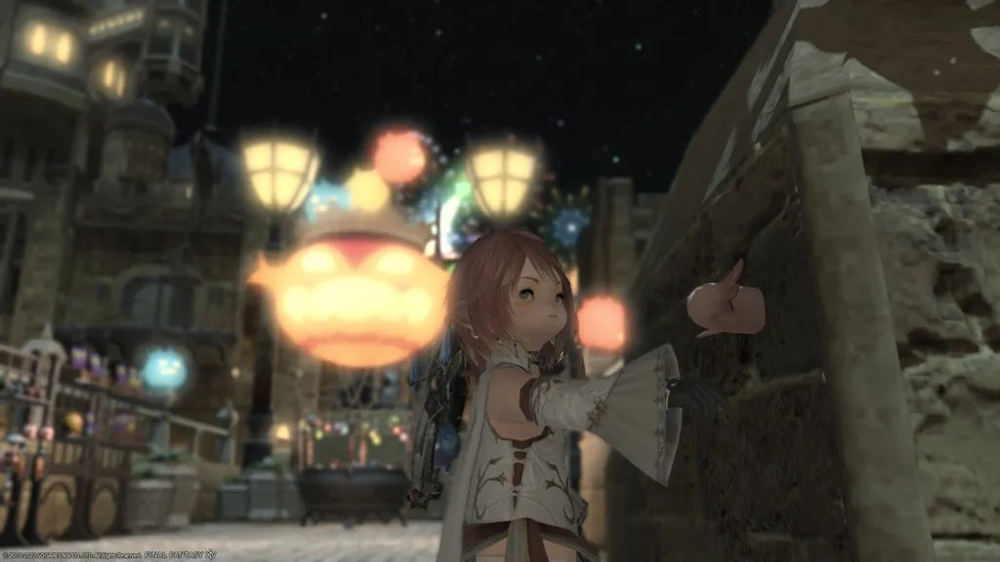
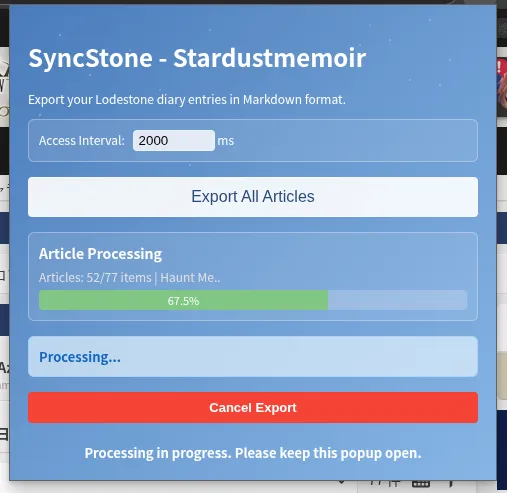
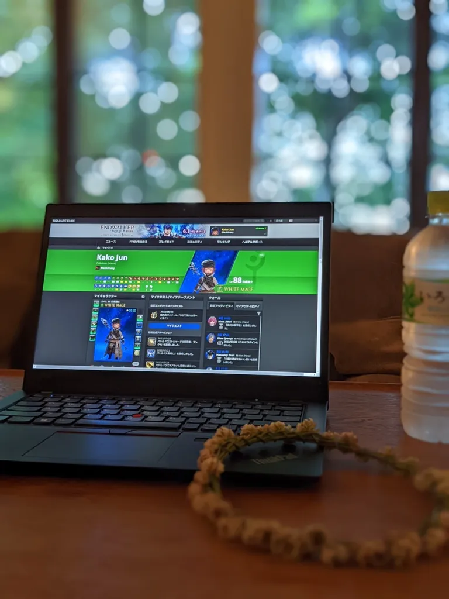

# SyncStone - Stardustmemoir Chrome Extension

[日本語](README.ja.md)

SyncStone, named "Stardustmemoir", is an unofficial tool related to FINAL FANTASY XIV. This extension operates as a standalone Chrome extension designed to export your diary entries from The Lodestone (FINAL FANTASY XIV's official player site) into Markdown format for local storage. Since The Lodestone lacks an export function, the primary goal is to help you back up your precious memories.

**Supported Regions**: JP, NA, EU, FR, DE (all Lodestone regions)

<p align="center">
  
</p>

## Screenshots

<p align="center">
  
</p>

## Features

*   **Export Single Article**: Exports the current Lodestone diary article page or diary editing page, including the article title, body, all images (both internal and external), comments, likes, publication date, and tags. It downloads a ZIP file containing the Markdown file and associated images.
*   **Export All Articles**: Exports all diary entries from The Lodestone's diary list page, including article titles, bodies, all images (both internal and external), comments, likes, publication dates, and tags. It converts them to Markdown format and downloads them as a unified ZIP file containing both articles and images. All images are downloaded and included in an `images/` folder within the ZIP file.
*   **Comment Retrieval**: Retrieves the full text of comments associated with articles and includes them in the Markdown files.
*   **Bulk Image Download**: When exporting all articles, all images from The Lodestone's image management page are pre-downloaded and included in the ZIP file. This prevents duplicate downloads of images referenced across multiple articles and ensures images are displayed correctly when viewed locally.
*   **Article List Generation**: When exporting all articles, an `index.md` file is generated within the ZIP file, containing links to all exported articles. This file can be conveniently used as a collection of links to your exported articles when opened with Markdown preview-enabled text editors like [Visual Studio Code](https://code.visualstudio.com/).

## Installation

### Option 1: Download from Releases (Recommended)
1.  Download the latest `sync-stone-chrome-extension.zip` from [GitHub Releases](https://github.com/kako-jun/sync-stone/releases).
2.  Extract the ZIP file to any folder.
3.  Open Chrome browser and navigate to `chrome://extensions`.
4.  Toggle on "Developer mode" in the top right corner.
5.  Click on the "Load unpacked" button.
6.  Select the extracted folder.
7.  The SyncStone extension will be added to Chrome.

### Option 2: Build from Source
1.  Clone or [download](https://github.com/kako-jun/sync-stone/archive/refs/heads/main.zip) this repository.
2.  Navigate to the `chrome-extension` folder and run:
    ```bash
    npm install
    npm run build
    ```
3.  Open Chrome browser and navigate to `chrome://extensions`.
4.  Toggle on "Developer mode" in the top right corner.
5.  Click on the "Load unpacked" button.
6.  Select the `chrome-extension/dist` folder.
7.  The SyncStone extension will be added to Chrome.

## Usage

### 1. Setting Access Interval

When you open the extension's popup, you'll find an input field for "Access Interval". This sets the waiting time (in milliseconds) between consecutive accesses to The Lodestone's server and affects both page loading timeouts and processing delays. To consider server load, the default is set to 2000 milliseconds (2 seconds) and cannot be set to less than 2000 milliseconds. Adjust as needed.

### 2. Exporting a Single Article

1.  Open the Lodestone diary article page (e.g., `https://{region}.finalfantasyxiv.com/lodestone/character/YOUR_CHARACTER_ID/blog/ARTICLE_ID/` where `{region}` is jp, na, eu, fr, or de) you wish to export.
2.  Click the SyncStone icon in your Chrome toolbar to open the popup.
3.  Click the "Export Current Article" button.
4.  A ZIP file containing the Markdown file and images will be downloaded.

### 3. Exporting All Articles

1.  Open The Lodestone's diary list page (e.g., `https://{region}.finalfantasyxiv.com/lodestone/character/YOUR_CHARACTER_ID/blog/` where `{region}` is jp, na, eu, fr, or de).
2.  Click the SyncStone icon in your Chrome toolbar to open the popup.
3.  Click the "Export All Articles" button.
4.  A confirmation dialog will appear, showing the number of articles to be exported and asking if you wish to proceed. Click "Yes" to start the export.
5.  A progress bar will be displayed during the export. Once completed, a ZIP file will be downloaded.

### 4. Exporting Other Players' Articles (Hidden Feature)

**Important**: This feature is provided with the expectation of appropriate use.

SyncStone can also export diary entries from other players using the same procedure. This is valuable in situations such as:

- **Preserving memories that would be lost due to account deletion**: When friends completely withdraw from FFXIV, their diaries become inaccessible. You can preserve the records of shared adventures and precious memories to prevent them from being lost.
- **Recording shared experiences**: Activities completed together, events participated in together, and other shared memories can be preserved as records.

**How to use**:
1. Open the diary list page of the other player whose articles you want to export
2. Follow the same procedure as for your own articles and click "Export All Articles"
3. The system automatically detects that these are another player's articles and processes them appropriately

**Technical differences**:
- For other players' articles, the image gallery pages are not accessible, so only images contained within the articles are downloaded
- The exported ZIP file will be named `lodestone_others_complete_export.zip` to distinguish it from your own articles (`lodestone_complete_export.zip`)

**Usage guidelines**:
- Please use this feature for the legitimate purpose of preserving memories
- Please respect privacy and use within appropriate bounds

### 5. Exported Files

The downloaded ZIP file will contain the following:

*   **Markdown files (`.md`)**: Each article is saved as a separate Markdown file. The filename will be in the format `001_ArticleTitle.md` with a sequential ID prefix to avoid duplicates.
    *   The beginning of each Markdown file will include the following metadata in YAML front matter format:
        *   `title`: Article title
        *   `date`: Publication date
        *   `likes`: Number of likes
        *   `comments`: Number of comments
        *   `tags`: List of tags
    *   Article body and comment content will be in Markdown format.
*   **`images/` folder**: All images (both internal Lodestone images and external images) are downloaded and saved in this folder. Image links within Markdown files will be rewritten to relative paths within this folder.
*   **`index.md`**: A Markdown file containing links to all exported articles. This file can be conveniently used as a collection of links to your exported articles when opened with Markdown preview-enabled text editors like [Visual Studio Code](https://code.visualstudio.com/).

### 6. Viewing Exported Markdown Files

It is recommended to open the exported Markdown files with a text editor that supports Markdown preview, such as [Visual Studio Code](https://code.visualstudio.com/). Ensure that the ZIP file is extracted and the Markdown files and `images/` folder are in the same directory. This will allow images to be displayed correctly in the Markdown preview.

## Important Notes

*   **Server Load**: The "Export All Articles" feature accesses The Lodestone's server consecutively. Please set the configurable access interval appropriately to avoid placing excessive load on the server.
*   **Image Download**: All images are downloaded and included in the ZIP file, including both internal Lodestone images and external images. If an image fails to download, the original URL will be preserved in the Markdown file.
*   **Lodestone Specification Changes**: If The Lodestone's HTML structure or specifications change, this extension may not function correctly.
*   **BBCode Conversion**: Lodestone's BBCode is retrieved as converted HTML and then converted to Markdown by the Turndown library. Special notations or complex layouts may not be perfectly reproduced.

## Technical Specifications

*   **Built with TypeScript**: The extension is developed using TypeScript for better code maintainability and type safety.
*   **Chrome Extension Manifest V3**: Fully compatible with the latest Chrome extension standards.
*   **Build System**: Uses Vite for fast development and production builds.
*   **Dynamic Timeout Management**: All timeouts are dynamically calculated based on the user's access interval setting to ensure consistent behavior.
*   **IndexedDB Storage**: Uses IndexedDB for efficient image data management, avoiding Chrome Service Worker memory limitations.
*   **Streaming ZIP Generation**: Utilizes zip.js for streaming ZIP creation, enabling stable processing of large amounts of image data without memory errors.

<div style="text-align: right; margin-top: 20px;">
  <div style="display: inline-block; vertical-align: middle; margin-right: 20px;">
    
  </div>
  <div style="display: inline-block; vertical-align: middle;">
    <p style="margin:0; padding:0; font-size:1.2em;">Thank you, FFXIV</p>
  </div>
</div>
