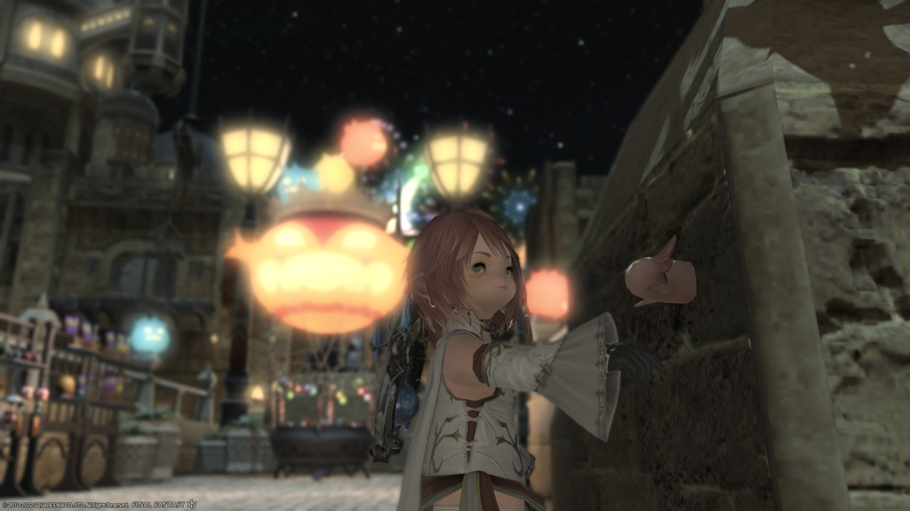
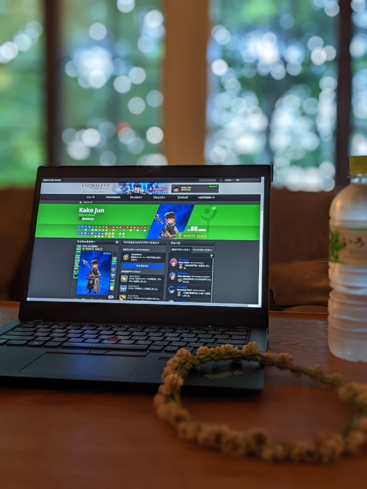

# SyncStone - Stardustmemoir Extension Chrome

SyncStone, nommé "Stardustmemoir", est un outil non officiel lié à FINAL FANTASY XIV. Cette extension fonctionne comme une extension Chrome autonome conçue pour exporter vos entrées de journal de The Lodestone (le site officiel des joueurs de FINAL FANTASY XIV) au format Markdown pour un stockage local. Étant donné que The Lodestone ne dispose pas de fonction d'exportation, l'objectif principal est de vous aider à sauvegarder vos précieux souvenirs.

<p align="center">
  
</p>

## Fonctionnalités

*   **Exporter un seul article**: Exporte la page d'article de journal Lodestone actuelle ou la page d'édition de journal, y compris le titre de l'article, le corps, toutes les images (internes et externes), les commentaires, les mentions J'aime, la date de publication et les balises. Il télécharge un fichier ZIP contenant le fichier Markdown et les images associées.
*   **Exporter tous les articles**: Exporte toutes les entrées de journal de la page de liste de journaux de The Lodestone, y compris les titres d'articles, les corps, toutes les images (internes et externes), les commentaires, les mentions J'aime, les dates de publication et les balises. Il les convertit au format Markdown et les télécharge sous forme de fichier ZIP unique. Toutes les images sont téléchargées et incluses dans un dossier `images/` dans le fichier ZIP.
*   **Récupération des commentaires**: Récupère le texte intégral des commentaires associés aux articles et les inclut dans les fichiers Markdown.
*   **Téléchargement en masse d'images**: Lors de l'exportation de tous les articles, toutes les images de la page de gestion d'images de The Lodestone sont pré-téléchargées et incluses dans le fichier ZIP. Cela évite les téléchargements en double d'images référencées dans plusieurs articles et garantit que les images sont affichées correctement lors de la consultation locale.
*   **Génération de la liste d'articles**: Lors de l'exportation de tous les articles, un fichier `Article_List.md` est généré dans le fichier ZIP, contenant des liens vers tous les articles exportés. Ce fichier peut être utilisé de manière pratique comme une collection de liens vers vos articles exportés lorsqu'il est ouvert avec des éditeurs de texte compatibles avec la prévisualisation Markdown comme [Visual Studio Code](https://code.visualstudio.com/).

## Installation

### Option 1: Télécharger depuis les Releases (Recommandé)
1.  Téléchargez le dernier `sync-stone-chrome-extension.zip` depuis [GitHub Releases](https://github.com/kako-jun/sync-stone/releases).
2.  Extrayez le fichier ZIP dans n'importe quel dossier.
3.  Ouvrez le navigateur Chrome et accédez à `chrome://extensions`.
4.  Activez le "Mode développeur" en haut à droite.
5.  Cliquez sur le bouton "Charger l'extension non empaquetée".
6.  Sélectionnez le dossier extrait.
7.  L'extension SyncStone sera ajoutée à Chrome.

### Option 2: Construire depuis la source
1.  Clonez ou [téléchargez](https://github.com/kako-jun/sync-stone/archive/refs/heads/main.zip) ce dépôt.
2.  Naviguez vers le dossier `chrome-extension` et exécutez:
    ```bash
    npm install
    npm run build
    ```
3.  Ouvrez le navigateur Chrome et accédez à `chrome://extensions`.
4.  Activez le "Mode développeur" en haut à droite.
5.  Cliquez sur le bouton "Charger l'extension non empaquetée".
6.  Sélectionnez le dossier `chrome-extension/dist`.
7.  L'extension SyncStone sera ajoutée à Chrome.

## Utilisation

### 1. Réglage de l'intervalle d'accès

Lorsque vous ouvrez la fenêtre contextuelle de l'extension, vous trouverez un champ de saisie pour "Intervalle d'accès". Cela définit le temps d'attente (en millisecondes) entre les accès consécutifs au serveur de The Lodestone et affecte également les délais de chargement des pages et les retards de traitement. Pour tenir compte de la charge du serveur, la valeur par défaut est de 2000 millisecondes (2 secondes) et ne peut pas être inférieure à 2000 millisecondes. Ajustez si nécessaire.

### 2. Exportation d'un seul article

1.  Ouvrez la page d'article de journal Lodestone ou la page d'édition de journal que vous souhaitez exporter.
2.  Cliquez sur l'icône SyncStone dans la barre d'outils de Chrome pour ouvrir la fenêtre contextuelle.
3.  Cliquez sur le bouton "Exporter l'article actuel".
4.  Un fichier ZIP contenant le fichier Markdown et les images sera téléchargé.

### 3. Exportation de tous les articles

1.  Ouvrez la page de liste de journaux de The Lodestone (par exemple: `https://jp.finalfantasyxiv.com/lodestone/character/YOUR_CHARACTER_ID/blog/`).
2.  Cliquez sur l'icône SyncStone dans la barre d'outils de Chrome pour ouvrir la fenêtre contextuelle.
3.  Cliquez sur le bouton "Exporter tous les articles".
4.  Une boîte de dialogue de confirmation apparaîtra, affichant le nombre d'articles à exporter et vous demandant si vous souhaitez continuer. Cliquez sur "Oui" pour démarrer l'exportation.
5.  Une barre de progression s'affichera pendant l'exportation. Une fois terminée, un fichier ZIP sera téléchargé.

### 4. Exportation des articles d'autres joueurs (Fonctionnalité cachée)

**Important** : Cette fonctionnalité est fournie avec l'attente d'une utilisation appropriée.

SyncStone peut également exporter les entrées de journal d'autres joueurs en utilisant la même procédure. Ceci est précieux dans des situations telles que :

- **Préservation des souvenirs qui seraient perdus en raison de la suppression de compte** : Lorsque des amis quittent complètement FFXIV, leurs journaux deviennent inaccessibles. Vous pouvez préserver les enregistrements d'aventures partagées et de souvenirs précieux pour éviter qu'ils ne soient perdus.
- **Enregistrement d'expériences partagées** : Les activités accomplies ensemble, les événements auxquels vous avez participé ensemble, et d'autres souvenirs partagés peuvent être préservés comme enregistrements.

**Comment utiliser** :
1. Ouvrez la page de liste de journaux de l'autre joueur dont vous voulez exporter les articles
2. Suivez la même procédure que pour vos propres articles et cliquez sur "Exporter tous les articles"
3. Le système détecte automatiquement qu'il s'agit d'articles d'un autre joueur et les traite de manière appropriée

**Différences techniques** :
- Pour les articles d'autres joueurs, les pages de galerie d'images ne sont pas accessibles, donc seules les images contenues dans les articles sont téléchargées
- Le fichier ZIP exporté sera nommé `lodestone_others_blog_export.zip` pour le distinguer de vos propres articles

**Directives d'utilisation** :
- Veuillez utiliser cette fonctionnalité dans le but légitime de préserver les souvenirs
- Veuillez respecter la vie privée et utiliser dans des limites appropriées

### 5. Fichiers exportés

Le fichier ZIP téléchargé contiendra les éléments suivants:

*   **Fichiers Markdown (`.md`)**: Chaque article est enregistré en tant que fichier Markdown distinct. Le nom du fichier sera basé sur le titre de l'article.
    *   Le début de chaque fichier Markdown inclura les métadonnées suivantes au format YAML front matter:
        *   `title`: Titre de l'article
        *   `date`: Date de publication
        *   `likes`: Nombre de mentions J'aime
        *   `comments`: Nombre de commentaires
        *   `tags`: Liste des balises
    *   Le corps de l'article et le corps des commentaires seront au format Markdown.
*   **Dossier `images/`**: Les images internes à Lodestone (images du domaine `finalfantasyxiv.com`) sont téléchargées et enregistrées dans ce dossier. Les liens d'image dans les fichiers Markdown seront réécrits en chemins relatifs dans ce dossier.
*   **`Article_List.md`**: Un fichier Markdown contenant des liens vers tous les articles exportés. Ce fichier peut être utilisé de manière pratique comme une collection de liens vers vos articles exportés lorsqu'il est ouvert avec des éditeurs de texte compatibles avec la prévisualisation Markdown comme [Visual Studio Code](https://code.visualstudio.com/).

### 6. Affichage des fichiers Markdown exportés

Il est recommandé d'ouvrir les fichiers Markdown exportés avec un éditeur de texte prenant en charge la prévisualisation Markdown, tel que [Visual Studio Code](https://code.visualstudio.com/). Assurez-vous que le fichier ZIP est extrait et que les fichiers Markdown et le dossier `images/` se trouvent dans le même répertoire. Cela permettra aux images d'être affichées correctement dans la prévisualisation Markdown.

## Remarques importantes

*   **Charge du serveur**: La fonction "Exporter tous les articles" accède consécutivement au serveur de The Lodestone. Veuillez définir l'intervalle d'accès configurable de manière appropriée pour éviter de surcharger le serveur.
*   **Images externes**: Les images provenant de domaines autres que The Lodestone ne seront pas téléchargées et resteront liées avec leurs URL d'origine dans les fichiers Markdown.
*   **Modifications des spécifications de Lodestone**: Si la structure HTML ou les spécifications de The Lodestone changent, cette extension pourrait ne pas fonctionner correctement.
*   **Conversion BBCode**: Le BBCode de Lodestone est récupéré sous forme de HTML converti, puis converti en Markdown par la bibliothèque Turndown. Les notations spéciales ou les mises en page complexes peuvent ne pas être parfaitement reproduites.

<div style="text-align: right; margin-top: 20px;">
  <div style="display: inline-block; vertical-align: middle; margin-right: 20px;">
    
  </div>
  <div style="display: inline-block; vertical-align: middle;">
    <p style="margin:0; padding:0; font-size:1.2em;">Merci, FFXIV</p>
  </div>
</div>